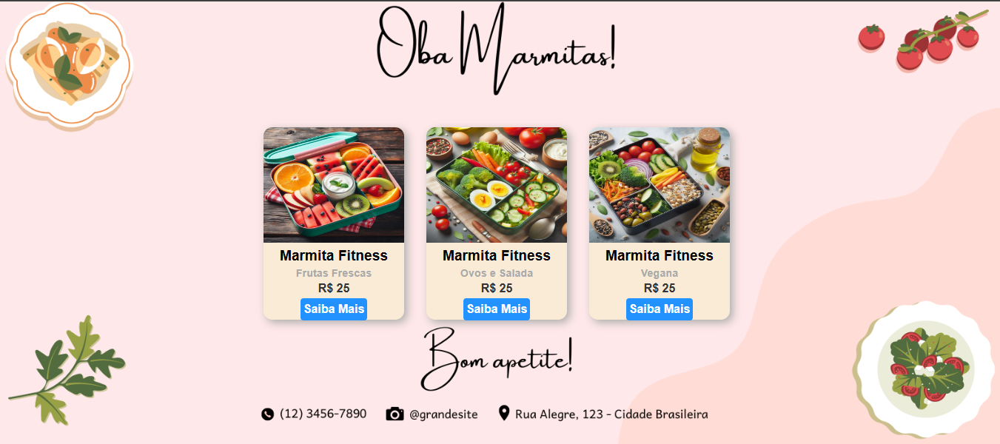

# Projeto de Web Cards - Marmitas Fitness

Este projeto consiste em uma página web que exibe cards de produtos de marmitas fitness, criados utilizando HTML e CSS. Cada card apresenta uma imagem do produto, título, descrição e um botão "Saiba Mais" que direciona para o WhatsApp para mais informações.

## Demonstração

Veja o projeto em funcionamento [aqui](https://souzvitor.github.io/projetomarmitasoba.io/).



## Tecnologias Utilizadas

- HTML
- CSS

## Como Usar

1. Clone o repositório:

   ```bash
   git clone https://github.com/SouzVitor/Card-Feito-Com-HTML-CSS.git

### Explicação do Conteúdo do README

- **Título e Descrição**: Descreve o objetivo do projeto e o que ele apresenta.
- **Demonstração**: Link para visualização do projeto ao vivo usando GitHub Pages.
- **Tecnologias Utilizadas**: Lista as principais tecnologias empregadas no projeto.
- **Como Usar**: Instruções para clonar e executar o projeto localmente.
- **Contribuições**: Incentiva contribuições e orienta sobre como propor mudanças.
- **Licença**: Informa sobre a licença do projeto para uso e distribuição.

### Próximos Passos

1. **Edite o README.md**: Você pode acessar e editar diretamente no seu repositório do GitHub para ajustar detalhes ou adicionar mais informações conforme necessário.
   
2. **Commit e Push**: Após editar o arquivo README.md, faça commit e push para o GitHub para que as alterações sejam refletidas no seu repositório online.


